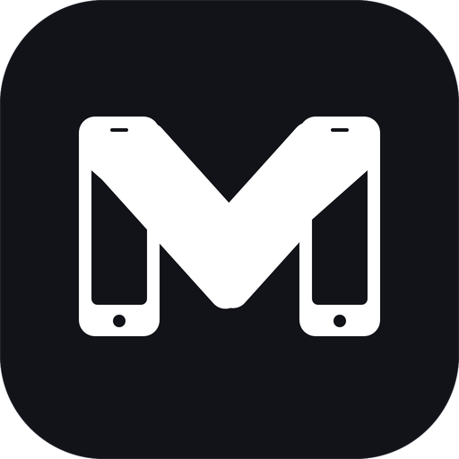
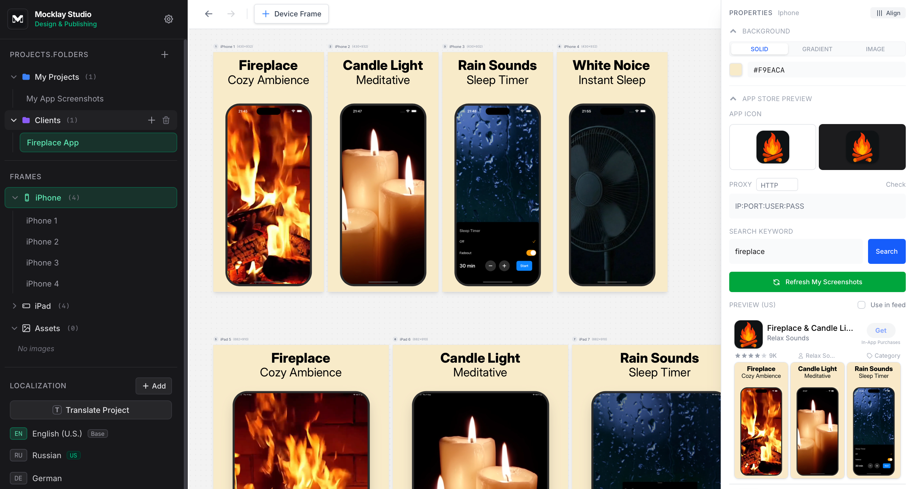
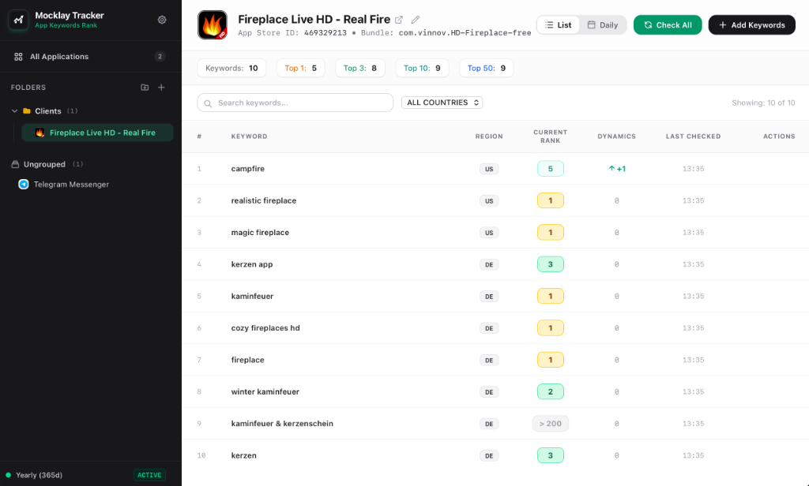

<p align="center">
  
</p>

<h1 align="center">Mocklay Desktop Suite</h1>

<p align="center">
  <strong>Focused, privacy-first desktop tools for indie mobile developers.</strong><br />
  Everything you need to design, localize, publish, and track your mobile apps on the App Store and Google Play — without the subscription grind or cloud lock-in.
</p>

<p align="center">
  <a href="https://github.com/dem7799/mocklay_release/releases"></a>
  <a href="https://tauri.app"></a>
  <a href="https://svelte.dev"></a>
  <a href="https://mocklay.com"></a>
  <a href="https://mocklay.com"></a>
</p>

---

## 🧭 Overview

Mobile release prep and store monitoring shouldn't eat up your afternoons. Every release cycle forces indie developers into the same frustrating loop: juggling dozens of screenshot dimensions, translating captions into 40+ languages, manually copy-pasting metadata into web consoles, and paying monthly recurring fees just to track keyword positions.

**Mocklay** solves this with two dedicated, native desktop applications engineered with **Rust** and **Svelte 5**:

1. [🎨 **Mocklay Studio**](#-mocklay-studio--screenshots--store-publishing) — Design, localize, and publish App Store & Google Play screenshots and store metadata in one sitting.
2. [📈 **Mocklay Tracker**](#-mocklay-tracker--daily-app-store-ranking-monitor) — Track your App Store keyword rankings daily with full historical snapshots and zero third-party API dependencies.

---

## 🎨 Mocklay Studio — Screenshots & Store Publishing

> **Design once, translate into 40+ languages, export every device size, and publish directly to App Store Connect & Google Play Console.**

<p align="center">
  
</p>

### 💡 The Problem It Solves
Preparing store listings is tedious manual labor:
- 10+ screenshot sizes required per locale (iPhone 6.9", 6.7", 6.5", 5.5", iPad 13", iPad 12.9", Android Phone, Tablet).
- Rebuilding layouts manually for each translated language.
- Opening App Store Connect and Google Play Console in a browser and dragging hundreds of images by hand.

### ✨ Key Features & Capabilities

- **Infinite Visual Board**: Design all your frames, devices, and locales side-by-side on a fluid infinite canvas with real-time zooming and panning.
- **Pixel-Perfect Device Frames & Mockups**: Authentic 2D and 3D device frames (iPhone 16 Pro, iPad Pro, Android flagship phones, etc.) with customizable shadows, colors, corner radii, and tilt angles.
- **Seamless Panoramic Backgrounds**: Create continuous multi-frame panoramic visuals where device mockups and gradients flow across adjacent screenshot cards.
- **1-Click AI Localization (BYOK)**: Connect your own AI API key (OpenRouter or Google Gemini Direct) to translate all headlines, subtitles, and descriptions across dozens of languages in seconds — with zero per-export fees.
- **Full Store Metadata Management**: Craft and manage titles, subtitles, keywords, promotional text, descriptions, and release notes right alongside your visual screenshots.
- **In-App Purchases (IAP) Promo Cards**: Design promotional asset cards for your in-app subscriptions and consumables.
- **Direct Store Publishing (No Browser Needed)**:
  - **App Store Connect**: Upload screenshot sets directly via the official App Store Connect API (`.p8` private key + JWT).
  - **Google Play Console**: Publish localized screenshots directly via Google Play Developer API (Service Account JSON).
- **100% Offline & Portable Projects**: Save projects locally in standard formats; export and import complete projects via `.zip` bundles containing all source assets and `project.json`.

### 🔄 The 4-Step Studio Workflow

```
┌────────────────────────┐      ┌────────────────────────┐      ┌────────────────────────┐      ┌────────────────────────┐
│ 01. Layout & Mockups   │ ───► │ 02. AI Localization    │ ───► │ 03. Auto-Export        │ ───► │ 04. 1-Click Publishing │
│ Pick device templates  │      │ Translate text & titles│      │ Generate all store     │      │ Upload straight to     │
│ & compose your screens │      │ into all target locales│      │ dimensions in one go   │      │ App Store & Google Play│
└────────────────────────┘      └────────────────────────┘      └────────────────────────┘      └────────────────────────┘
```

---

## 📈 Mocklay Tracker — Daily App Store Ranking Monitor

> **Accurate, native App Store keyword tracking that stays out of your way. Run checks up to 200 positions deep with zero third-party API subscriptions.**

<p align="center">
  
</p>

### 💡 The Problem It Solves
Most ASO and keyword tracking tools are bloated web SaaS platforms charging $50–$200/month for metered queries and keeping your competitive keyword data on external servers.

### ✨ Key Features & Capabilities

- **Direct Apple Search Scraping**: Queries the public Apple iTunes Search API directly. **No DataForSEO, no third-party API keys, and no monthly API bills.**
- **Up to 200 Positions Deep**: Search up to 200 results per keyword to catch newly indexed apps and climbing keywords before they break into the Top 50.
- **All 175+ App Store Regions**: Track rankings in any country (`US`, `GB`, `DE`, `FR`, `JP`, `KR`, `BR`, `RU`, etc.) with independent keyword sets per region.
- **Full Day-by-Day Historical Snapshots**: View complete ranking history grids over 7, 14, 30, 60, 90 days, or All Time. Export history to CSV at any time.
- **At-a-Glance Ranking Dynamics**: Instant indicators for position changes: Top 1, Top 3, Top 10, Top 50 distribution with clear green/red delta badges (`+3`, `-1`).
- **Live App Store Lookup**: Add apps by simply typing the title, Apple App ID, or pasting the `apps.apple.com` URL — app metadata and high-res icons auto-populate instantly.
- **Multi-App Folders & Organization**: Organize dozens of apps and client portfolios into customizable folders with drag-and-drop hierarchy.
- **Background Automation & Native Tray**:
  - Run scheduled daily checks automatically at your preferred local time.
  - Minimize to system tray on macOS and Windows.
  - Native OS notifications when daily ranking runs complete.
- **Proxy Support (HTTP, HTTPS, SOCKS5)**: Built-in proxy configuration with authentication and remote DNS for high-volume or region-specific querying.

### 🔄 The 4-Step Tracker Workflow

```
┌────────────────────────┐      ┌────────────────────────┐      ┌────────────────────────┐      ┌────────────────────────┐
│ 01. Add Your App       │ ───► │ 02. Input Keywords     │ ───► │ 03. Scheduled Checks   │ ───► │ 04. Analyze Trends     │
│ Search App Store link, │      │ Paste target keywords  │      │ Automated daily runs   │      │ Track rank history,    │
│ name, or Store ID      │      │ & select target regions│      │ or instant manual check│      │ deltas & Top 1/3/10/50 │
└────────────────────────┘      └────────────────────────┘      └────────────────────────┘      └────────────────────────┘
```

---

## 🛡️ Why Mocklay? Core Architecture & Advantages

| Feature | Mocklay Suite | Traditional Cloud SaaS |
| :--- | :--- | :--- |
| **Data Privacy & Storage** | **100% Local-First** (`JSON` database on your disk) | Stored on third-party remote cloud servers |
| **Account Requirement** | **None** — install and run instantly | Mandatory account signup & email verification |
| **Pricing Model** | **One flat annual license** (all features included) | Expensive monthly subscriptions ($50–$250/mo) |
| **API Costs** | **$0** (Direct Apple search, Bring-Your-Own AI key) | Metered credit limits & per-query surcharges |
| **Performance** | **Tauri v2 + Rust** (< 50MB RAM, sub-second launch) | Sluggish browser tabs & heavy Electron wrappers |
| **Offline Capability** | **Full offline support** for design & local DB | Broken without active internet connection |
| **Device Allowance** | **Up to 5 computers** per license | Usually locked to 1 user seat |

### 🔒 Privacy by Default
Your unreleased apps, design concepts, and competitive keyword strategies are confidential.
- **Zero telemetry & tracking:** No Google Analytics, Mixpanel, or third-party trackers bundled.
- **Local persistence:** All projects, screenshots, and keyword histories live inside your operating system's application support directory:
  - **macOS:** `~/Library/Application Support/`
  - **Windows:** `%APPDATA%\`
- **Zero-Knowledge Licensing:** Keys are validated using salted SHA-256 hashes and AES-256-GCM encryption.

---

## 📥 Download & System Requirements

Download official signed binaries directly from our [GitHub Releases](https://github.com/dem7799/mocklay_release/releases) page:

### Mocklay Studio

| OS | Architecture | File | Min. Requirement |
| :--- | :--- | :--- | :--- |
| **macOS** | Universal (Apple Silicon M1-M4 & Intel) | [`Mocklay.Studio_0.1.2_universal.dmg`](https://github.com/dem7799/mocklay_release/releases/download/studio-v0.1.2/Mocklay.Studio_0.1.2_universal.dmg) | macOS 11.0 (Big Sur) or later |
| **Windows** | x64 (64-bit) | [`Mocklay.Studio_0.1.2_x64-setup.exe`](https://github.com/dem7799/mocklay_release/releases/download/studio-v0.1.2/Mocklay.Studio_0.1.2_x64-setup.exe) | Windows 10 / 11 (64-bit) |

### Mocklay Tracker

| OS | Architecture | File | Min. Requirement |
| :--- | :--- | :--- | :--- |
| **macOS** | Universal (Apple Silicon M1-M4 & Intel) | [`Mocklay.Tracker_0.1.2_universal.dmg`](https://github.com/dem7799/mocklay_release/releases/download/tracker-v0.1.2/Mocklay.Tracker_0.1.2_universal.dmg) | macOS 11.0 (Big Sur) or later |
| **Windows** | x64 (64-bit) | [`Mocklay.Tracker_0.1.2_x64-setup.exe`](https://github.com/dem7799/mocklay_release/releases/download/tracker-v0.1.2/Mocklay.Tracker_0.1.2_x64-setup.exe) | Windows 10 / 11 (64-bit) |

---

## ⚡ First-Time Launch Guide

### macOS
When opening the application for the first time:
1. Drag the `.app` into your **Applications** folder.
2. If macOS displays an *"unidentified developer"* prompt:
   - In Finder, open **Applications**, right-click (or `Control` + click) on **Mocklay Studio** / **Mocklay Tracker**, and select **Open**.
   - Or run this command in Terminal to clear the quarantine flag:
     ```bash
     xattr -cr "/Applications/Mocklay Studio.app"
     # or for Tracker:
     xattr -cr "/Applications/Mocklay Tracker.app"
     ```

### Windows
If Windows SmartScreen prompts on first run:
- Click **"More info"** → **"Run anyway"**.

---

## 🎁 7-Day Unrestricted Free Trial

Both applications include a **7-Day Free Trial** with 100% full feature access on your computer:
- No credit card required.
- No feature gates or export watermarks during the trial period.
- Activate instantly on first launch from the app welcome screen.

To purchase an annual license:
- **Mocklay Studio:** [Get License on Gumroad](https://dimvibe.gumroad.com/l/mocklaystudio) ($12/month, billed annually)
- **Mocklay Tracker:** [Get License on Gumroad](https://dimvibe.gumroad.com/l/mocklaytracker) ($9/month, billed annually)

---

## 🤝 Support & Feedback

- **Website:** [mocklay.com](https://mocklay.com)
- **Email:** [hello@mocklay.com](mailto:hello@mocklay.com)
- **Releases & Issues:** [dem7799/mocklay_release/releases](https://github.com/dem7799/mocklay_release/releases)

---

## 📄 License

© Mocklay. All rights reserved.
